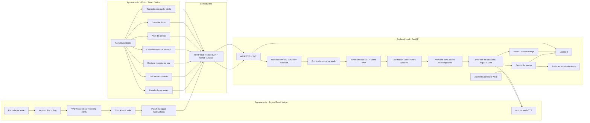

# TFG-DEMENCIA: Asistente IA para personas con demencia

## Descripción

Aplicación móvil y backend local para asistir a personas con demencia o Alzheimer. La app permite registrar dos roles, paciente y cuidador, y ofrece un flujo completo de escucha, transcripción, análisis contextual, alertas y respuesta por voz.

El paciente activa la escucha desde la app. El audio se graba localmente con `expo-av`, se segmenta en chunks cortos mediante detección de silencio basada en metering dBFS y cada chunk se sube completo al backend con HTTP `multipart/form-data`. No se usa WebSocket ni una conexión continua de audio: el flujo es grabar chunk, cerrar archivo, subirlo, procesarlo y recibir una respuesta JSON.

El backend transcribe cada chunk con `faster-whisper`, aplica VAD interno de Silero para reducir silencio y alucinaciones, identifica al hablante si existe una muestra de voz del paciente, analiza posibles episodios con reglas y LLM, y guarda transcripciones, alertas y diario. La app del paciente puede reproducir respuestas con `expo-speech`; la app del cuidador permite gestionar contexto, revisar alertas, reproducir audio archivado y consultar resúmenes recientes.

## Arquitectura general



## Funcionalidades principales

- Registro e inicio de sesión con roles `caregiver` y `patient`.
- Vinculación paciente-cuidador mediante el email del cuidador durante el registro del paciente.
- Captura de audio en la app paciente con segmentación local por silencio.
- Envío de chunks de audio al backend como archivos `.m4a` mediante `multipart/form-data`.
- Transcripción local con `faster-whisper` y filtrado de silencio con Silero VAD.
- Detección de episodios mediante frases de alerta, expresiones regulares, contexto del paciente y LLM.
- Asistente por palabras de activación configurables, sin crear alerta.
- Respuesta por voz al paciente con `expo-speech`.
- Registro de muestra de voz y diarización paciente/no paciente mediante SpeechBrain ECAPA-TDNN.
- Gestión de alertas con transcripción, audio archivado y ACK del cuidador.
- Diario de memoria a largo plazo generado en segundo plano a partir de transcripciones recientes.
- Endurecimiento básico de seguridad: JWT, roles, límite de request, retención de audio y checks de producción.

## Requisitos previos

| Componente | Versión mínima | Notas |
|---|---:|---|
| Python | 3.11+ | Backend FastAPI |
| Node.js | 18+ | Frontend Expo |
| MariaDB | 10.6+ | Base de datos |
| Ollama | Latest | LLM local por defecto |
| CUDA toolkit | 11.8+ | Recomendado para Whisper en GPU |
| Expo Go / Expo CLI | Latest | Ejecución de la app móvil |
| FFmpeg / ffprobe | Latest | Comprobación y conversión de audio |

> El backend también puede ejecutarse en CPU cambiando `STT_DEVICE=cpu`, aunque la latencia será mayor.

## Inicio rápido

Si quedan procesos antiguos en puertos de desarrollo, ejecuta:

```powershell
.\scripts\kill-processes.ps1
```

### 1. Base de datos

Opción A: MariaDB local ya instalado.

```powershell
mysql -u root -p < backend/init_db.sql
mysql -u root -p < backend/fix_auth.sql
```

`fix_auth.sql` crea o ajusta el usuario `tfg_app`, necesario especialmente en instalaciones recientes de MariaDB.

Opción B: contenedor solo para MariaDB.

```powershell
docker run -d --name mariadb `
  -e MARIADB_ROOT_PASSWORD=rootpass `
  -e MARIADB_DATABASE=tfg_demencia `
  -p 3306:3306 `
  mariadb:11

docker exec -i mariadb mysql -u root -prootpass < backend/init_db.sql
```

El proyecto no incluye un despliegue completo por contenedores; esta opción solo levanta la base de datos.

### 2. Ollama

Instala Ollama y descarga el modelo configurado por defecto:

```powershell
ollama pull mistral:7b-instruct
ollama run mistral:7b-instruct "Responde OK."
```

Ollama se expone por defecto en `http://127.0.0.1:11434`. El script del backend comprueba que Ollama esté disponible y que el modelo configurado exista localmente.

### 3. Backend

```powershell
.\scripts\run-backend.ps1
```

El script:

- libera el puerto `8000` si había un proceso anterior;
- comprueba que MariaDB esté ejecutándose;
- arranca Ollama si no está activo;
- valida que el modelo LLM configurado exista localmente;
- activa `.venv`;
- configura valores de entorno de desarrollo;
- lanza `uvicorn` en `http://0.0.0.0:8000`.

Cuando esté corriendo:

- API: `http://localhost:8000`
- Swagger UI: `http://localhost:8000/docs`
- Healthcheck: `http://localhost:8000/health`

### 4. Frontend

Primero genera el `.env` del frontend con la IP adecuada:

```powershell
.\scripts\update-frontend-env.ps1
```

Después lanza Expo:

```powershell
.\scripts\run-frontend.ps1
```

El script instala dependencias si faltan. Si detecta IP de Tailscale, la usa para Expo; si no, usa modo tunnel. Escanea el QR con Expo Go para probar la app.

## Scripts disponibles

| Script | Qué hace |
|---|---|
| `scripts\run-backend.ps1` | Comprueba MariaDB/Ollama/modelo, activa `.venv` y lanza FastAPI |
| `scripts\run-frontend.ps1` | Instala dependencias si faltan y lanza Expo |
| `scripts\update-frontend-env.ps1` | Escribe `frontend/app/.env` con IP Tailscale o LAN |
| `scripts\get-ip.ps1` | Muestra IPs IPv4 activas |
| `scripts\kill-processes.ps1` | Mata procesos habituales de frontend/backend |

## Flujo de prueba completo

1. Registra un cuidador desde la pantalla de login: `Regístrate` -> `Responsable`.
2. Cierra sesión y registra un paciente: `Regístrate` -> `Paciente` -> introduce el email del cuidador.
3. Inicia sesión como cuidador y abre el paciente vinculado.
4. Edita el contexto:
   - perfil del paciente;
   - dirección habitual;
   - nombres de cuidadores;
   - notas médicas;
   - frases de alerta;
   - reglas regex;
   - palabras de activación del asistente.
5. Graba una muestra de voz del paciente de 10 segundos para habilitar diarización.
6. Inicia sesión como paciente y pulsa `Activar escucha`.
7. Prueba una frase de alerta, por ejemplo `ayuda` o `no sé dónde estoy`.
8. Prueba una palabra de activación, por ejemplo `asistente`, si la configuraste en el contexto.
9. Vuelve como cuidador y revisa:
   - alerta nueva;
   - severidad y razón;
   - transcripción etiquetada;
   - audio archivado;
   - ACK de la alerta;
   - diario del paciente.

## Configuración Tailscale

Tailscale es la forma recomendada de conectar móviles y PC sin exponer el backend a Internet. El código no obliga a usar Tailscale; es una decisión de despliegue.

1. Instala Tailscale en el PC del backend y en los móviles.
2. Inicia sesión en la misma tailnet.
3. Obtén la IP Tailscale del PC:

```powershell
tailscale ip -4
```

4. Configura el frontend para apuntar al backend:

```env
EXPO_PUBLIC_SERVER_URL=http://100.x.y.z:8000
```

También puedes ejecutar:

```powershell
.\scripts\update-frontend-env.ps1
```

El script prefiere IP Tailscale y usa IP LAN como alternativa.

## Estructura del proyecto

```text
TFG-DEMENCIA/
├── backend/
│   ├── init_db.sql
│   ├── fix_auth.sql
│   ├── requirements.txt
│   └── src/
│       ├── server.py
│       ├── config.py
│       ├── database.py
│       ├── auth.py
│       ├── middleware/
│       │   └── size_limit.py
│       ├── models/
│       │   ├── user.py
│       │   ├── patient.py
│       │   ├── transcript.py
│       │   ├── alert.py
│       │   └── journal.py
│       ├── schemas/
│       ├── routes/
│       │   ├── auth.py
│       │   ├── patients.py
│       │   ├── audio.py
│       │   └── alerts.py
│       └── services/
│           ├── stt_service.py
│           ├── speaker_id_service.py
│           ├── episode_detector.py
│           ├── assistant_service.py
│           ├── memory_service.py
│           └── llm/
│               ├── base.py
│               ├── ollama_provider.py
│               ├── openai_provider.py
│               └── factory.py
├── frontend/
│   └── app/
│       ├── App.js
│       ├── app.json
│       ├── package.json
│       └── src/
│           ├── components/
│           │   ├── AlertCard.js
│           │   └── PhraseListEditor.js
│           ├── screens/
│           │   ├── LoginScreen.js
│           │   ├── PatientHomeScreen.js
│           │   ├── CaregiverHomeScreen.js
│           │   ├── PatientContextScreen.js
│           │   └── SettingsScreen.js
│           └── services/
│               ├── api.js
│               └── session.js
├── docs/
│   └── MODULES.md
└── scripts/
    ├── run-backend.ps1
    ├── run-frontend.ps1
    ├── update-frontend-env.ps1
    ├── get-ip.ps1
    └── kill-processes.ps1
```

`docs/MODULES.md` contiene una explicación más detallada de los módulos internos.

## Variables de entorno del backend

| Variable | Default | Descripción |
|---|---|---|
| `PRODUCTION` | `0` | Si `1`/`true`, rechaza configuración insegura al arrancar |
| `DB_HOST` | `127.0.0.1` | Host de MariaDB |
| `DB_PORT` | `3306` | Puerto de MariaDB |
| `DB_NAME` | `tfg_demencia` | Nombre de la base de datos |
| `DB_USER` | `tfg_app` | Usuario de la base de datos |
| `DB_PASSWORD` | `tfg_pass_2024` *(dev)* | **OBLIGATORIO cambiar en producción** |
| `JWT_SECRET` | `dev-only-insecure-secret` *(dev)* | **OBLIGATORIO cambiar en producción** |
| `JWT_EXPIRE_MINUTES` | `1440` | Expiración de tokens |
| `CORS_ORIGINS` | `http://localhost:19000,http://localhost:19006,http://localhost:8081` | Allowlist CSV para clientes web/dev |
| `MAX_BODY_BYTES` | `52428800` | Tamaño máximo de request |
| `MAX_CONCURRENT_AUDIO` | `5` | Máximo de chunks procesados simultáneamente |
| `STT_MODEL` | `medium` | Modelo `faster-whisper` |
| `STT_DEVICE` | `cuda` | `cuda` o `cpu` |
| `STT_NO_SPEECH_THRESHOLD` | `0.7` | Umbral de no voz |
| `STT_LOG_PROB_THRESHOLD` | `-0.8` | Filtrado por baja probabilidad |
| `STT_COMPRESSION_RATIO_THRESHOLD` | `2.2` | Filtrado de salidas repetitivas |
| `STT_MIN_SILENCE_MS` | `300` | Silencio mínimo para VAD interno |
| `STT_INITIAL_PROMPT` | Prompt en español | Prompt inicial para Whisper |
| `SPEAKER_DEVICE` | `cpu` | Dispositivo para SpeechBrain |
| `LLM_PROVIDER` | `ollama` | `ollama` u `openai` |
| `LLM_MODEL` | `mistral:7b-instruct` | Modelo LLM |
| `OLLAMA_URL` | `http://127.0.0.1:11434` | URL de Ollama |
| `OPENAI_API_KEY` | vacío | API key si `LLM_PROVIDER=openai` |
| `OPENAI_BASE_URL` | `https://api.openai.com/v1` | Endpoint compatible OpenAI |
| `STM_WINDOW_MINUTES` | `5` | Ventana de memoria a corto plazo |
| `STM_MAX_UTTERANCES` | `12` | Máximo de frases en STM |
| `STM_MAX_CHARS` | `1500` | Límite de caracteres en STM |
| `JOURNAL_INTERVAL_MINUTES` | `5` | Intervalo mínimo entre resúmenes de diario |
| `JOURNAL_RETENTION_HOURS` | `24` | Retención del diario |
| `JOURNAL_MAX_ENTRIES` | `200` | Máximo de entradas de diario por paciente |
| `TRANSCRIPT_RETENTION_DAYS` | `14` | Retención temporal de transcripciones |
| `TRANSCRIPT_MAX_ROWS` | `5000` | Máximo de transcripciones por paciente |
| `ALERTS_AUDIO_DIR` | `backend/data/alert_audio` | Directorio de audio archivado en alertas |
| `ALERT_AUDIO_ACK_GRACE_HOURS` | `24` | Horas tras ACK antes de borrar audio |
| `ALERT_AUDIO_MAX_DAYS` | `30` | Retención máxima de audio de alertas |

---

## ⚠️ Antes de desplegar en producción

**Esta sección es crítica.** El proyecto incluye valores por defecto pensados únicamente para desarrollo local. Antes de cualquier despliegue accesible fuera de un entorno controlado, revisa esta checklist. Si `PRODUCTION=1` está activo, el servidor se negará a arrancar mientras detecte secretos o parámetros inseguros.

1. **`JWT_SECRET` — CRÍTICO.** El valor por defecto (`dev-only-insecure-secret`) permite a cualquiera firmar tokens válidos. Genera uno aleatorio de al menos 32 bytes:

   ```powershell
   python -c "import secrets; print(secrets.token_urlsafe(48))"
   ```

   Expórtalo como variable de entorno. No lo metas en el repositorio.

2. **`PRODUCTION=1` — OBLIGATORIO.** Actívalo en el entorno del servidor para forzar las comprobaciones de arranque sobre `JWT_SECRET`, `DB_PASSWORD` y `CORS_ORIGINS`.

3. **`DB_PASSWORD` — OBLIGATORIO cambiar.** La contraseña de desarrollo (`tfg_pass_2024`) aparece en los scripts SQL y no debe usarse fuera de local. Cámbiala en MariaDB y expórtala con `DB_PASSWORD`.

4. **`CORS_ORIGINS` — NO usar comodines.** Restringe la allowlist a orígenes reales si incorporas clientes web. La app móvil React Native no depende de CORS como un navegador.

5. **Red privada o HTTPS — OBLIGATORIO para datos reales.** El backend sirve HTTP plano. Para uso real, mantenlo dentro de LAN/Tailscale o colócalo detrás de un reverse proxy con TLS. Los tokens JWT, transcripciones y audio del paciente no deben viajar en claro por redes no confiables.

6. **Límites y retención — revisar por privacidad/RGPD.**
   - `MAX_BODY_BYTES` limita el tamaño de las peticiones.
   - El backend descarta audios de más de 30 segundos.
   - `MAX_CONCURRENT_AUDIO` limita trabajos pesados simultáneos.
   - `TRANSCRIPT_RETENTION_DAYS` y `TRANSCRIPT_MAX_ROWS` controlan transcripciones.
   - `ALERT_AUDIO_ACK_GRACE_HOURS` y `ALERT_AUDIO_MAX_DAYS` controlan audio de alertas.

7. **Almacenamiento local y audio.**
   - El token JWT se guarda en la app con `expo-secure-store`.
   - Los chunks sin alerta se eliminan tras procesarse.
   - Los chunks con alerta se archivan temporalmente para que el cuidador pueda revisarlos.

> Si cualquiera de los puntos críticos falla con `PRODUCTION=1`, el backend debe detener el arranque y mostrar qué configuración falta corregir.

## API Reference

La documentación interactiva completa está disponible en `/docs` cuando el backend está corriendo.

### Endpoints principales

| Método | Ruta | Rol | Uso |
|---|---|---|---|
| `POST` | `/auth/register` | Público | Registro cuidador/paciente |
| `POST` | `/auth/login` | Público | Login y JWT |
| `GET` | `/patients/` | Cuidador | Listar pacientes vinculados |
| `GET` | `/patients/{id}/context` | Cuidador | Obtener contexto |
| `PUT` | `/patients/{id}/context` | Cuidador | Actualizar contexto |
| `POST` | `/patients/{id}/voice-sample` | Cuidador | Subir muestra de voz |
| `GET` | `/patients/{id}/journal` | Cuidador | Consultar diario |
| `POST` | `/audio/chunk` | Paciente | Subir chunk de audio |
| `GET` | `/alerts/` | Cuidador | Listar alertas |
| `GET` | `/alerts/{id}/audio` | Cuidador | Reproducir audio archivado |
| `POST` | `/alerts/{id}/ack` | Cuidador | Aceptar alerta |
| `GET` | `/health` | Público | Estado backend/LLM |

## Decisiones de diseño

### ¿Por qué una sola app con dos roles?

- Reduce duplicación de código en autenticación, navegación y cliente API.
- Permite distribuir una única app.
- El rol recibido tras login decide la pantalla inicial y permisos visibles.

### ¿Por qué chunks HTTP y no envío continuo?

- Simplifica la app móvil y el backend.
- Permite procesar cada archivo de audio como unidad independiente.
- Evita mantener conexiones largas desde el móvil.
- Facilita guardar solo el audio que genera alerta y borrar el resto.

### ¿Por qué VAD en frontend y también en backend?

- El frontend usa metering dBFS para decidir cuándo cerrar y enviar un chunk.
- El backend usa Silero VAD integrado en `faster-whisper` para limpiar regiones sin voz antes de transcribir.
- La app calibra su umbral con los timestamps devueltos por Whisper.

### ¿Por qué reglas + LLM?

- Las reglas y regex configuradas por el cuidador son rápidas y deterministas.
- El LLM aporta análisis contextual cuando no hay coincidencia directa.
- Si el LLM falla, las reglas siguen actuando como fallback.

### ¿Por qué SpeechBrain para diarización?

- La muestra de voz permite crear un embedding local del paciente.
- Cada segmento se compara contra ese embedding para etiquetar `[PACIENTE]` u `[OTRO]`.
- Las reglas se aplican sobre texto del paciente cuando hay diarización disponible, reduciendo falsas alertas por frases dichas por otra persona.

### ¿Por qué memoria STM/LTM?

- La memoria a corto plazo se reconstruye desde transcripciones recientes y se inyecta en prompts del LLM.
- La memoria a largo plazo se guarda como entradas de diario resumidas por el LLM.
- El cuidador puede revisar actividad reciente sin leer todas las transcripciones.

### ¿Por qué Strategy Pattern para LLM?

- Permite alternar entre Ollama local y un proveedor compatible con OpenAI mediante variables de entorno.
- Mantiene el detector desacoplado del proveedor concreto.
- Facilita incorporar otros proveedores o mocks en el futuro.

### ¿Por qué MariaDB con campos JSON?

- Combina tablas relacionales para usuarios, pacientes, transcripciones y alertas con flexibilidad JSON para el contexto del paciente.
- El contexto cambia con frecuencia y puede incluir frases, reglas, estilo de respuesta, datos personales y palabras de activación.

## Cambiar el modelo LLM

Usar otro modelo local de Ollama:

```powershell
ollama pull openhermes
$env:LLM_MODEL="openhermes"
.\scripts\run-backend.ps1
```

Usar un proveedor compatible con OpenAI:

```powershell
$env:LLM_PROVIDER="openai"
$env:OPENAI_API_KEY="sk-..."
$env:LLM_MODEL="gpt-4o-mini"
.\scripts\run-backend.ps1
```

## Troubleshooting

| Problema | Solución |
|---|---|
| `CUDA out of memory` al cargar Whisper | Usa `STT_MODEL=base` o `STT_MODEL=small`, o cambia `STT_DEVICE=cpu` |
| La app no conecta con el backend | Desde el móvil no uses `localhost`; usa IP LAN o Tailscale del PC |
| Ollama no responde | Comprueba `ollama list` y que `ollama serve` esté activo |
| El modelo LLM no existe | Ejecuta `ollama pull mistral:7b-instruct` o cambia `LLM_MODEL` |
| MariaDB connection error | Comprueba servicio MariaDB, puerto 3306 y credenciales |
| Audio demasiado largo | Reduce `MAX_CHUNK_MS` en frontend o revisa el VAD local |
| No aparece diarización | Graba una nueva muestra de voz desde la pantalla del cuidador |
| No se reproduce audio de alerta | Comprueba que la alerta tenga `audio_url` y que el token del cuidador sea válido |
